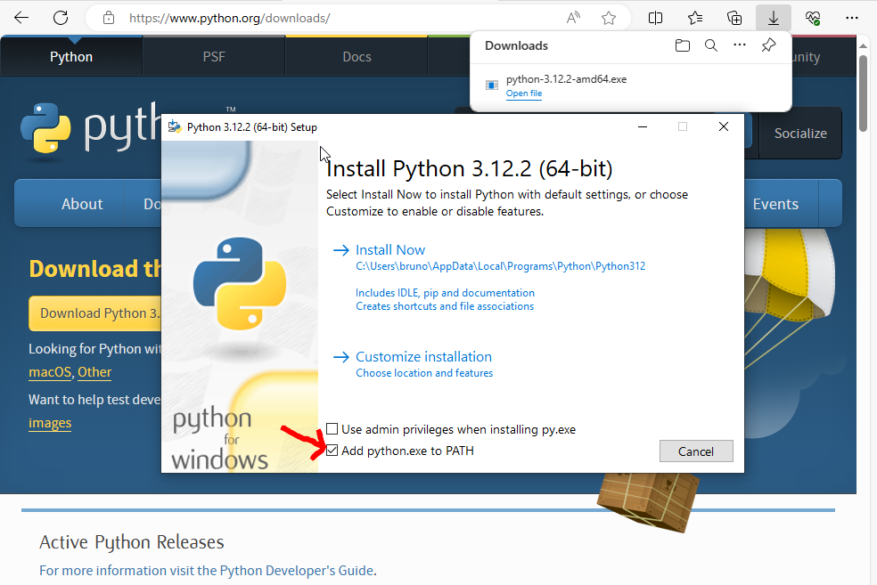
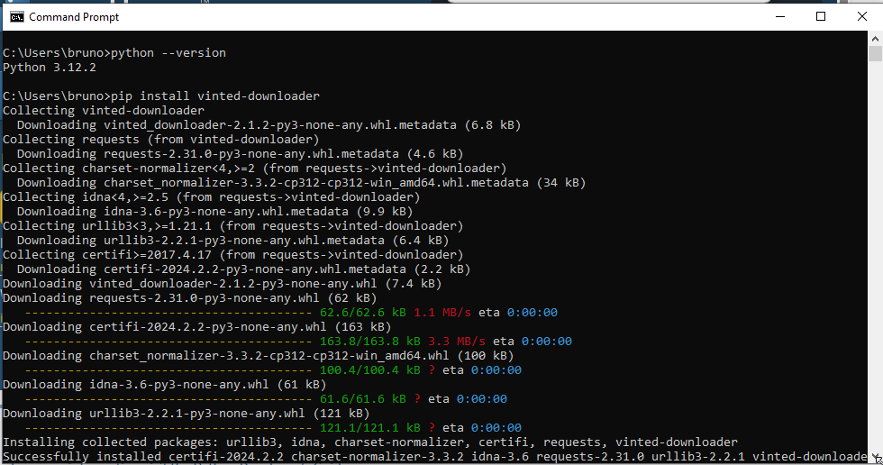

# Vinted Product Downloader

Vinted is a website to buy and sell second-hand clothes available in several countries in Europe.  Sometimes it's useful to download the photographs of an article.

At the time of writing (October the 14th, 2023), scrapping information from the Vinted website is somewhat easy.  You can find all the details below. You can download all the photographs with a small bash script, without even needing python.

But if you want more information (not just the photographs) or don't know how to pipe commands on the command line, here is a python script that will:

- download and extract the details about a Vinted product. This json contains all the information available for the product, the user, the photographs, etc.
- download all the photographs of the product in full resolution
- download the profile picture of the seller (with the `--seller` option)

It is working like this:

```bash
python3 vinted_downloader.py "PRODUCT_URL"
# or, to also download the seller profile:
python3 vinted_downloader.py --seller "PRODUCT_URL"
# or, to also download all items available on the seller profile:
python3 vinted_downloader.py --all "PRODUCT_URL"
```

Then you get the following files:

- `item.json`: all the information you want and you don't want
- `item_summary`: main information (url, title, description, etc.)
- `photo_01.jpg`: all the photos for the item
- `seller.jpg`: with the `--seller` option

Use the `-o` option to specify an output directory (default is current directory).  If it doesn't exist, it will be created. If you want to save the files in a subdirectory of the `-o` directory automatically named after the item id and title, then use the `--save-in-dir` option.  For example, to automatically create and save in the `my-output/1234-item-title/` directory, run:

```bash
python3 vinted_downloader.py -o my-output --save-in-dir "https://www.vinted.fr/items/1234-item-title"
```

If you omit the `-o` option, it will be saved in a subdirectory of the current directory, namely `./1234-item-title/`.

If the item is sold, then go to the url will redirect to the category, not the item, except if you are logged in. To avoid that, add `?noredirect=1` at the end of the url.

If you have installed it with `pip`, you can also use the `vinted-downloader` command:

```bash
vinted-downloader "PRODUCT_URL"
vinted-downloader --seller "PRODUCT_URL"
vinted-downloader --all "PRODUCT_URL"
```


## How to install?


### With `pip`

#### On Linux or MacOS

The Vinted product download is on PyPI, so you can run:

```bash
pip3 install vinted-downloader
```

All dependencies are installed automatically.

You can then use the command `vinted-downloader` like this:

```bash
vinted-downloader [--seller] [-o DIR] [--all] "PRODUCT_URL"
```

or, if you prefer to use python:

```bash
python3 -m vinted_downloader [--seller] [-o DIR] [--all] "PRODUCT_URL"
```

To update the package, run:

```bash
pip3 install --upgrade vinted-downloader
```


#### On Windows

First you need to install Python:

- go to https://www.python.org/downloads/
- download the installer "Python for Windows"
- run the installer (click on the downloaded file)
   - check the box "Add python.exe to PATH" (this is **VERY IMPORTANT**, see the image below)
   - click on "Install Now"



Then open the Command Prompt (type "prompt" in the search bar at the bottom of the screen):

- type `python --version` to check that Python is correctly installed (you should see the version of Python, and not an error message)
- type `pip install vinted-downloader`. This will install the downloader and its dependencies




Then use it, like described above. For example:

```bash
vinted-downloader "PRODUCT_URL"
vinted-downloader --seller "PRODUCT_URL"
vinted-downloader --all "PRODUCT_URL"
```


If the command `vinted-downloader` doesn't work, use:

```bash
python -m vinted_downloader "PRODUCT_URL"
```

To update, run:

```bash
pip install --upgrade vinted-downloader
```


### From the sources

Clone the github repository and install the dependencies.

For Linux and MacOS:


```bash
# clone:
git clone https://github.com/boberle/vinted-downloader.git

# install deps:
cd vinted-downloader
python3 -m venv venv
source venv/bin/activate
pip install -r requirements.txt

# use:
python3 vinted_downloader.py "PRODUCT_URL"
```


## How does it work?

All the item information is in a JSON file downloaded alongside the HTML file. The product id is found in the url of an item: `https://www.vinted.TLD/items/ITEM_ID-slug`.

Once you got the item id you just need to download the JSON file at `https://www.vinted.TLD/api/v2/items/ITEM_ID?localize=false`.

If you download it with curl, for example, you will get an "unauthorized" error. You need to connect first to an HTML page (eg the vinted home page, with the same TLD of the product page) to get the authentication cookies (even if it's an anonymous authentication) and then reuse them. This is why the bash script below uses 2 `curl` commands.

The interesting parts of the JSON are the following ones (using `jq` format):

```
cat itemdetails.json | jq ".item.title"
cat itemdetails.json | jq ".item.description"
cat itemdetails.json | jq ".item.photos[] | .full_size_url"
cat itemdetails.json | jq ".item.user.login"
cat itemdetails.json | jq ".item.user.last_logged_on_ts"
cat itemdetails.json | jq ".item.user.photo.full_size_url"
```

But you can find a lot more information in the json (the price, if the item is reserved, hidden, etc.), really everything that is displayed on the page, and even more.

So, if you want to download the photos in the original size using only a bash script:

```bash
url=$1

item_id=`echo "$url" | grep -oP "(?<=/)\d+(?=-)"`

curl \
-H "Accept: text/html,application/xhtml+xml,application/xml;q=0.9,image/avif,image/webp,*/*;q=0.8" \
-H "Accept-Encoding: gzip, deflate, br" \
-H "Accept-Language: fr-FR,fr;q=0.5" \
-H "Connection: keep-alive" \
-H "Sec-Fetch-Dest: document" \
-H "Sec-Fetch-Mode: navigate" \
-H "Sec-Fetch-Site: cross-site" \
-H "TE: trailers" \
-H "Upgrade-Insecure-Requests: 1" \
-H "User-Agent: Mozilla/5.0 (X11; Linux x86_64; rv:109.0) Gecko/20100101 Firefox/118.0" \
--cookie-jar "vinted_cookies.txt" \
--output vinted_home.out \
"https://www.vinted.fr"

curl \
-H "Accept: text/html,application/xhtml+xml,application/xml;q=0.9,image/avif,image/webp,*/*;q=0.8" \
-H "Accept-Encoding: gzip, deflate, br" \
-H "Accept-Language: fr-FR,fr;q=0.5" \
-H "Connection: keep-alive" \
-H "Sec-Fetch-Dest: document" \
-H "Sec-Fetch-Mode: navigate" \
-H "Sec-Fetch-Site: cross-site" \
-H "TE: trailers" \
-H "Upgrade-Insecure-Requests: 1" \
-H "User-Agent: Mozilla/5.0 (X11; Linux x86_64; rv:109.0) Gecko/20100101 Firefox/118.0" \
--cookie "vinted_cookies.txt" \
--output vinted_item.out \
"https://www.vinted.fr/api/v2/items/$item_id?localize=false"

count=0
for photo_url in `cat vinted_item.out | gzip -d | jq -r ".item.photos[] | .full_size_url"`
do
   curl \
   -H "Accept: text/html,application/xhtml+xml,application/xml;q=0.9,image/avif,image/webp,*/*;q=0.8" \
   -H "Accept-Encoding: gzip, deflate, br" \
   -H "Accept-Language: fr-FR,fr;q=0.5" \
   -H "Connection: keep-alive" \
   -H "Sec-Fetch-Dest: document" \
   -H "Sec-Fetch-Mode: navigate" \
   -H "Sec-Fetch-Site: cross-site" \
   -H "Upgrade-Insecure-Requests: 1" \
   -H "User-Agent: Mozilla/5.0 (X11; Linux x86_64; rv:109.0) Gecko/20100101 Firefox/118.0" \
   --output "vinted_photo_$count.jpg" \
   $photo_url
   ((count++)) || true
done
```

Just save it in a file `download_full_size_images.sh` and call it with:

```bash
bash -e -x download_full_size_images.sh URL_OF_THE_ITEM
```

(adapt the TLD in the script to the TLD of your item)

## Version

This is version 2. Not back compatible with version 1.
